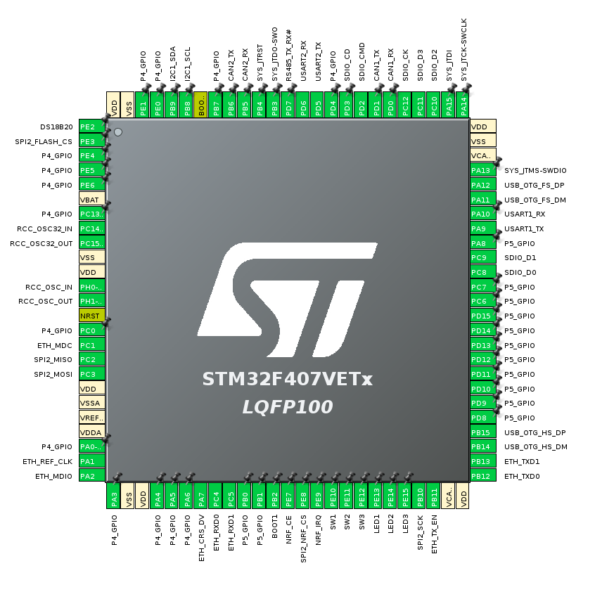

## STM32F407VET6 Industrial Board

I came across [this board](https://www.aliexpress.com/item/1005002760530120.html) on AliExpress and naively assumed it would have some software support! 
It doesn't, and worse than that it doesn't come with any schematics.
So I set about working out what is connected where with a multimeter. 
This repository contains a snapshot of the code generated by CubeMX, along with some tests that check each of the peripherals.

Peripherals:
 - CAN1: Working*
   - Needs HW mod (Ground not connected!)
 - CAN2: Working
 - RS485: Working
   - USART2 + GPIO for TX/#RX
 - DB9 Serial Port: Working
   - USART1
 - SD Card: Working
 - 8MB W25Q64JV Flash: Working
 - 256B AT24C02 Flash: Working
 - RTC: Working
 - Buttons: Working
 - LEDs: Working
 - USB Device: Working
 - USB Host: Working
 - Ethernet: Working*
   - Gets an IP, no further work done

## STM32F407 Pinout
I have all of the on-board peripherals working. This is the pinout from the main SoC as shown in CubeMX:

## HW Modification Required
The CAN transceiver for CAN1 does not have its ground pin connected. 
You must make a connection from the bottom of C22 to the bottom of C21.

## Building
Install the arm-none-eabi tools.
> apt install gcc-arm-none-eabi  
> make

## Flashing
The STM32F407 has built in DFU functionality. 
Move the BOOT0 jumper from '0' to '1', and connect the mini USB connection to a PC. 

> make flash

Now move the BOOT0 jumper back to '0' and hit reset / power cycle the board.
